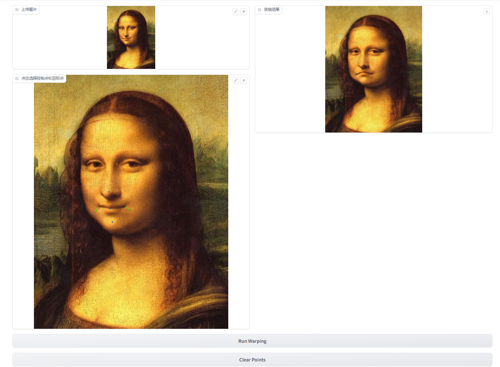
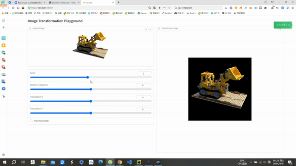

# Implementation of Image Geometric Transformation
This repository is Jiahao Zhang's implementation of Assignment_01 of DIP.


## Requirements

To install requirements:

```bash
python -m pip install -r requirements.txt
```

## Running
To run basic transformation, run:

```bash
python run_global_transform.py
```

To run point guided transformation, run:

```bash
python run_point_transform.py
```
## Results

### Basic Transformation


### Point Guided Deformation:


## Acknowledgement

📋 Thanks for the algorithms proposed by [Image Deformation Using Moving Least Squares](https://people.engr.tamu.edu/schaefer/research/mls.pdf).

