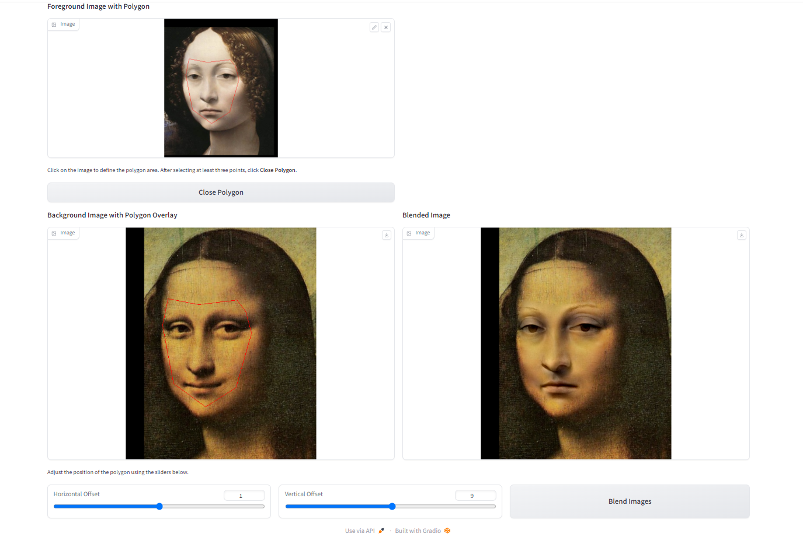
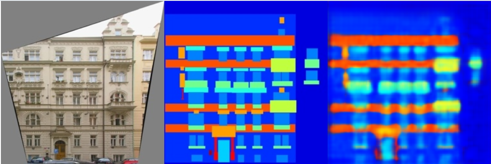
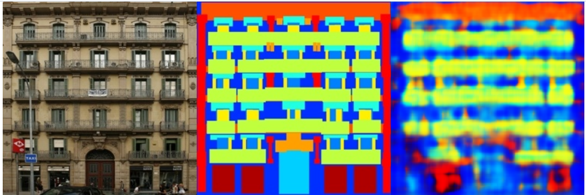

# Implementation of Image Geometric Transformation
This repository is Jiahao Zhang's implementation of Assignment_02 of DIP.

## Requirements

To install requirements:

```bash
python -m pip install -r requirements.txt
```

## Running
To run Poisson Image Editing with PyTorch, run:

```bash
python run_blending_gradio.py
```

To run point Pix2Pix, run:

```bash
python train.py
```
## Results

### Poisson Image Editing with PyTorch


### Pix2Pix
Partial results of training sets and validation sets

train_results:

valid_results:


## Acknowledgement

📋 Thanks for the algorithms of image editing proposed by [Poisson Image Editing](https://www.cs.jhu.edu/~misha/Fall07/Papers/Perez03.pdf).
📋 Thanks for the algorithms of the pix2pix proposed by [Fully Convolutional Networks for Semantic Segmentation](https://arxiv.org/abs/1411.4038).
