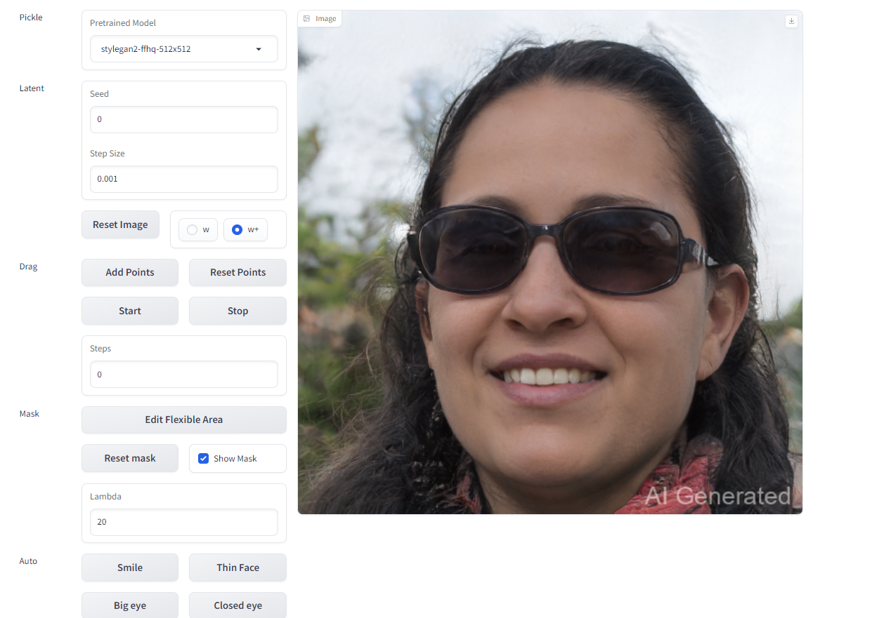

# Play with GANs
This repository is Jiahao Zhang's implementation of Assignment_03 of DIP.


## Requirements

To install requirements:

```bash
python -m pip install -r requirements.txt
```

## Running
To run point Pix2Pix with GANs, run:

```bash
python train.py
```
## Results

### Pix2Pix with GANs
Partial results of training sets and validation sets

train_results:


valid_results:


### Automatic editing with DragGANs

smile:

<p align="center">
  
  
</p>

## Acknowledgement

📋 Thanks for the algorithms of image editing proposed by [Poisson Image Editing](https://www.cs.jhu.edu/~misha/Fall07/Papers/Perez03.pdf).

📋 Thanks for the algorithms of the pix2pix proposed by [Fully Convolutional Networks for Semantic Segmentation](https://arxiv.org/abs/1411.4038).
