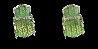
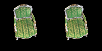

# Implement Simplified 3D Gaussian Splatting
This repository is Jiahao Zhang's implementation of Assignment_04 of DIP.

## Requirements

To install requirements:

```bash
python -m pip install -r requirements.txt
```

## Running
Use Colmap to recover camera poses and a set of 3D points:

```bash
python mvs_with_colmap.py --data_dir chair
```

Debug the reconstruction by running:

```bash
python debug_mvs_by_projecting_pts.py --data_dir chair
```

Build and train 3DGS model:

```bash
python train.py --colmap_dir chair --checkpoint_dir chair/checkpoints
```

## Results

### Simplified 3D Gaussian Splatting


### Original 3D Gaussian Splatting


## Acknowledgement

📋 Thanks for the algorithms of 3D Gaussian Splatting proposed by [3D Gaussian Splatting for Real-Time Radiance Field Rendering](https://www.cs.jhu.edu/~misha/Fall07/Papers/Perez03.pdf).
